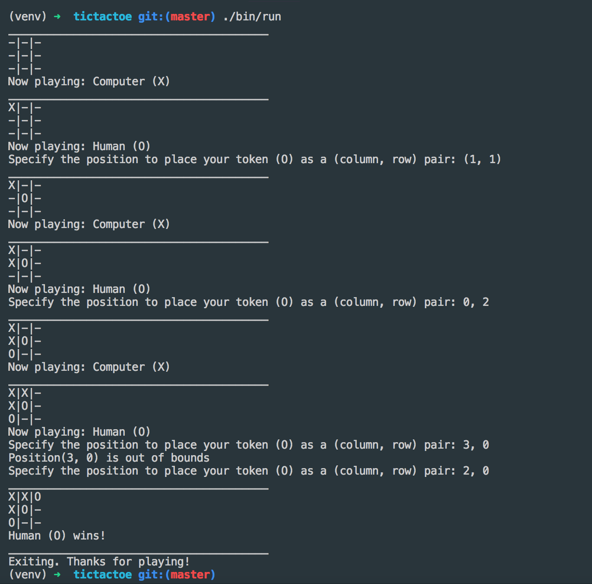

Tic-tac-toe
===========

A simple, text console-based implementation of the
`Tic-tac-toe <https://en.wikipedia.org/wiki/Tic-tac-toe>`__ game,
developed as my solution to an interview coding challenge.

Requires `Python 3.x <https://docs.python.org/3/>`__.
There are no dependencies other than the Python Standard Library.

* Run the game: ``./bin/run``
* Run unit tests: ``./bin/test``

